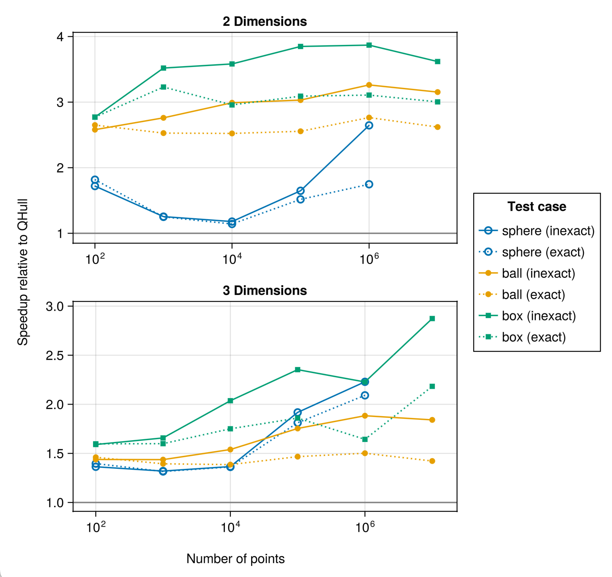

# Quickhull.jl

The quickhull algorithm in pure Julia for finding
convex hulls, Delaunay triangulations, and Voronoi diagrams in N dimensions.

```julia
using Quickhull

hull = quickhull(randn(100, 3))

# plotting compatibility:
using GLMakie, GeometryBasics
wireframe(GeometryBasics.Mesh(hull))
```

## QHull Comparison

Quickhull.jl is competetive with QHull's performance even
when exact arithmetic is used, although although it has fewer features.



## Robustness

`quickhull` can be run with various hyperplane kernels. A hyperplane
kernel is a method of calculating hyperplane-point distances. By default,
an exact kernel is used (i.e. the sign of the distance is always correct)
to ensure robustness. Robustness can be traded for speed by choosing an inexact
kernel, for instance:

```julia
quickhull(pts, Quickhull.Options(kernel = Quickhull.HyperplaneKernelInexact))
```

It should be noted that if an inexact kernel is used – particularly
on inputs with coplanar or nearly coplanar points – the topology of the
hull can be become corrupted and an error will probably occur.
